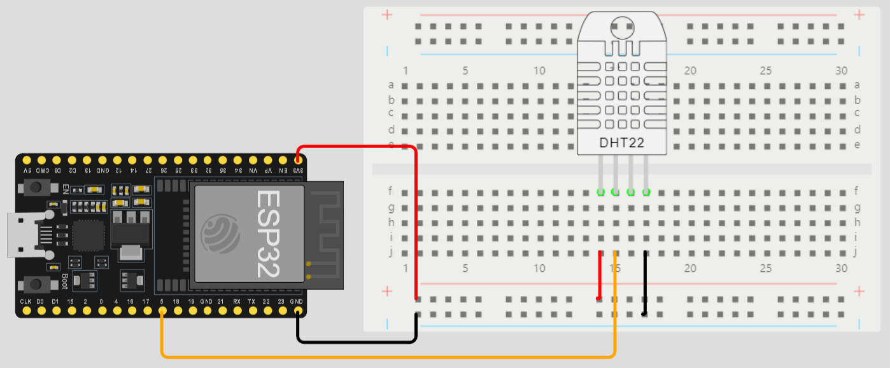

# Projeto da global solution IOT

### Descrição do Projeto

Este projeto de IoT tem como objetivo coletar dados de temperatura ambiente ao longo do tempo para analisar a relação entre a temperatura do ambiente e a qualidade do sono. Utilizando o ESP32 e o sensor DHT22, os dados são registrados e armazenados para possibilitar análises detalhadas sobre os padrões de sono.

### Componentes do Projeto

- **ESP32 e DHT22:**
- 
  - Dispositivos responsáveis pela coleta contínua de dados de temperatura.
- **Armazenamento de Dados:**
  - Utilização de bancos de dados para armazenar informações históricas de temperatura.

### Objetivo Principal

Analisar como a temperatura ambiente afeta a qualidade do sono, identificando padrões que possam ser utilizados para otimizar o ambiente de sono.

### Benefícios e Metas

- **Métricas de Saúde:**
  - Desenvolvimento de métricas específicas para avaliar a saúde do sono.
- **Análises Detalhadas:**
  - Oferta de análises detalhadas sobre o impacto de diferentes temperaturas no sono.

### Desenvolvimento Futuro

- **Aplicação Interativa:**
  - Criação de uma aplicação que se integra a smartwatches, fornecendo sugestões personalizadas para otimizar o ambiente de sono.

### Valor para o Usuário

- **Promoção de Hábitos Saudáveis de Sono:**
  - Capacitação do usuário para compreender e melhorar a qualidade do sono.
- **Prevenção de Distúrbios do Sono:**
  - Contribuição para a prevenção de distúrbios do sono por meio de intervenções proativas.

### Desenvolvimento Técnico

- **Algoritmos de Análise:**
  - Implementação de algoritmos inteligentes para interpretar os dados coletados.
- **Integração com Smartwatches:**
  - Desenvolvimento de uma integração eficiente com smartwatches dos usuários.

### Como Usar

1. **Configuração do Hardware:**
   - Conecte o ESP32 ao sensor DHT22 de acordo com as especificações.
   
2. **Configuração do Software:**
   - Instale as bibliotecas necessárias no ESP32.
   - Configure as credenciais de conexão ao banco de dados.

3. **Execução:**
   - Carregue o código no ESP32.
   - Os dados começarão a ser coletados automaticamente.
   - Link para o simulador do [Wokwi](https://wokwi.com/projects/381841485846924289) utilizado nos testes & desenvolvimento

### Conteúdo extra
- neste repositório, existe o arquivo **notebook.ipynb** que contem dados analisados, gráficos e métricas.
- link extra: [Link do video da aplicação Mobile](https://)
